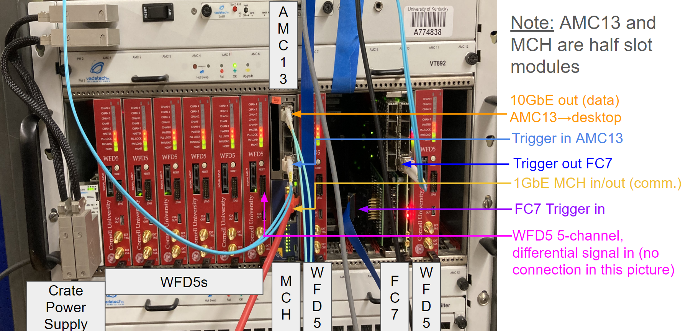

# Hardware Documentation

## General Hardware Overview
### Conceptual Diagram (One Crate System)
{: style="max-width:100%; height:auto;"}

- **Differential signal into WFD5 (Waveform Digitizer)**: Differential signaling are input into Cornell's WFD5s. Data is aggregated by AMC13 on triggers.
- **Trigger signal into FC7 (Flexible Controller)**: Provides flexible triggering, FC7 sends trigger signals over optical links to the AMC13.
- **AMC13 (Advanced Mezzanine Card)**: Aggregates data from digitizers on a trigger and packages for sending over 10GbE (10 Gigabit Ethernet). Transfers this to the desktop for further processing.
- **MCH (MicroTCA Carrier Hub)**: Facilitates communication between the desktop and the crate system via 1GbE Ethernet, managing system-level (crate) operations in a way.
- **Desktop CPU**: Processes events received from the AMC13. Data is unpacked and formed into midas events for storage.
- **Meinberg**: Provides precise trigger timestamps using GPS timing. This is an artifact of g-2 more than anything, were multiple disconnected systems needed to be correlated. 

### Labled Picture (One Crate System)
{: style="max-width:100%; height:auto;"}

---

## IPMI

### Overview

Intelligent Platform Management Interface (IPMI) is a standardized interface used for managing and monitoring computer systems. It allows for the remote management of systems independently of the operating system state or the system's power state. IPMI provides a way to manage a server using a set of standardized commands and messages that can be sent over a network or via a direct serial connection.

### Features of IPMI

- **Remote Management**: Allows administrators to remotely manage systems, including power on/off, rebooting, and accessing system logs.
- **Hardware Monitoring**: Monitors hardware components like temperature, voltage, fans, and power supply status.
- **Serial Over LAN (SOL)**: Provides serial console access over a network, allowing remote troubleshooting and management.
- **Event Logging**: Logs critical system events such as hardware failures or temperature thresholds being exceeded.
- **Security**: Supports user authentication, encrypted communication, and access control.

### Common IPMI Tools

- **ipmitool**: A command-line utility for managing IPMI-enabled devices. It supports a wide range of commands for sensor reading, system status checking, power control, and firmware updates. ipmitool commands are the building blocks used in many of the configuration scripts for the hardware. See [ipmitool](software_dependencies.md#ipmitool) for more information.

### Example Commands Using `ipmitool`

1 **Print Field Replaceable Unit (FRU) Information**:

```
ipmitool -H 192.168.1.15 fru print
```

This command retrieves and prints the Field Replaceable Unit (FRU) information from the IPMI device located at IP address `192.168.1.15`.

- `-H 192.168.1.15`: Specifies the IP address of the IPMI device. Replace `192.168.1.15` with the actual IP address of your IPMI device.
- `fru print`: Command to retrieve and display the FRU information. FRU information includes details about hardware components that can be replaced in the system, such as part numbers and descriptions.

2 **Send Raw Command to IPMI Device**:

```
ipmitool -I lan -H 192.168.1.15 -m 0x20 -B 0 -T 0x82 -b 7 -t 0x86 raw 0x06 0x1
```

This command sends a raw IPMI command to a device over LAN with specified parameters.

- `-I lan`: Specifies the interface type (`lan` in this case), which indicates that the IPMI command will be sent over the LAN interface.
- `-H 192.168.1.15`: Specifies the IP address of the IPMI device.
- `-m 0x20`: Specifies the channel number to communicate with the BMC (Baseboard Management Controller). The default is usually `0x20`, but for some reason we need to specify this on some systems.
- `-B 0`: Specifies the BMC instance number.
- `-T 0x82`: Specifies the target address in the IPMI device. This is the MCH.
- `-b 7`: Specifies the bus number.
- `-t 0x86`: Specifies the target channel number. This is the device you're targeting, in this case it's FC7 in slot 11 of the microTCA crate.
- `raw 0x06 0x1`: Command to send a raw IPMI command (`0x06 0x1` in this case) to the specified IPMI device. The raw command `0x06 0x1` varies based on the specific IPMI command you intend to send.

You can read a bit more about these commands in the manuals linked in the [MCH section](hardware_overview.md#mch-microtca-carrier-hub). You can read more about ipmitool's command arguments on [this webpage](https://linux.die.net/man/1/ipmitool).

---

## 1GbE NIC (Gigabit Ethernet Network Interface Card)

### Overview

These NICs are generally PCIe Cards that are "plug and play". They provide a 1 gigabit per second ethernet connection for the host computer.

### Configuration
If you machine has a GUI, you may find it easier to edit network settings that way. Otherwise, you can edit settings from command line. For example for UKY's teststand we use:
```
nmcli connection modify enp5s0 \
    ipv4.addresses 192.168.1.100/16 \
    ipv4.method manual \
    connection.autoconnect yes \
    ipv6.method ignore
```

You may need to create a connection configuration file first if it doesn't exist. For example for UKY's teststand we use:
```
nmcli connection add type ethernet con-name enp5s0 ifname enp5s0
```

In particular, the `ipv4.addresses` is important. Here the port is specified to accept any traffic on the 192.168.xxx.xxx subnet. See the [networking page](networking.md#networking-basics) for more details.

---

## 10GbE NIC (10 Gigabit Ethernet Network Interface Card)

### Overview

These NICs are generally PCIe Cards that are "plug and play". They provide a 10 gigabit per second ethernet connection for the host computer. In our case, we use optical cables that plug into SFPs. **The MTU (Maximum Transmission Unit) of the card should be 9000 or greater**.

### Configuration

If you machine has a GUI, you may find it easier to edit network settings that way. Otherwise, you can edit settings from command line. For example, for UKY's teststand we use these settings: 

```
nmcli connection modify enp1s0f0 \
    ipv4.addresses 192.168.51.100/24 \
    ipv4.method manual \
    connection.autoconnect yes \
    connection.autoconnect-priority -999 \
    802-3-ethernet.mtu 9000 \
    ipv6.method ignore
```

You may need to create a connection configuration file first if it doesn't exist. For example for UKY's teststand we use:
```
nmcli connection add type ethernet con-name enp1s0f0 ifname enp1s0f0
```

In particular, the `ipv4.addresses` and `802-3-ethernet.mtu` sections are important. Here the port is specified to accept any traffic on the 192.168.51.xxx subnet. See the [networking page](networking.md#networking-basics) for more details.

---

## µTCA Crate (Micro Telecommunications Computing Architecture Crate)

### Overview

Micro Telecommunications Computing Architecture (µTCA or MicroTCA) is a modular, high-performance architecture designed for telecommunications and other industries requiring reliable, scalable, and high-bandwidth systems. CERN employs µTCA systems for the acquisition and processing of vast amounts of data generated by particle detectors. These systems are capable of handling high-speed data streams and ensuring data integrity and accuracy.

For our purposes, you can just view it as an electronics crate to host the [MCH](hardware_overview.md#mch-microtca-carrier-hub), [FC7](hardware_overview.md#fc7-flexible-controller), and [WFD5](hardware_overview.md#wfd5-waveform-digitizer).

### Configuration

The µTCA Crate should be "plug and play" in our case; no configuration is needed.

---

## MCH (MicroTCA Carrier Hub)

### Overview

For our purposes, the MCH acts as a point of communication between the crate and the computer hosting the frontends. Here, we will cover specifically setting up VadaTech MCHs, however the system can also be run using [N.A.T. MCH](miscellaneous_info.md#the-nat-mch).

### Wired Connections

#### 1GbE Ethernet Connection

The MCH should have an ethernet port labeled `GbE0` or `1GbE` (or something along those lines). Use an ethernet cable to connect this to your system's [1GbE NIC](hardware_overview.md#1gbe-nic-gigabit-ethernet-network-interface-card). 

See the [labeled DAQ Picture](hardware_overview.md#labled-picture-one-crate-system) 1GbE MCH in/out.

### Configuration
First you should [configure the 1GbE NIC](hardware_overview.md#1gbe-nic-gigabit-ethernet-network-interface-card) if you haven't already.

Here are some pdfs that may be be helpful:

- [MCH Manual PDF](pdfs/MCH_manual.pdf)
- [MCH Network Configuration PDF](pdfs/mch_network_configuration.pdf)

#### Changing MCH Network Settings

Below is a stripped down version of [MCH Network Configuration PDF](pdfs/mch_network_configuration.pdf); you can read the pdf for more details.

1 **Connect to the MCH's Linux environment**

Plug an Ethernet cable into the GbE0 port and the frontend host computer. From a terminal, run

```
ssh root@192.168.[crate].15
```
The password should be `root`.

**Note**: If you don't know what IP the MCH has, you can try pinging a crate numbers up to 32
```
ping 192.168.[crate].15
```
If you still can't find the crate, you should verify your frontend host computer's ethernet port is properly configured. See the [networking page](networking.md#networking-basics) for some general networking information. If that still fails, you may need to do a [network scan](networking.md#scanning-a-network) to look for the MCH.

**Note**: The error `Bad server host key: Invalid key length` may be due to OpenSSH versions >7.8 (August 2018) requiring rsa keys to be at least 2048 bits. The MCH may be configured to have a key shorter than this. Dropbear (a lightweight ssh client) has no such requirement and should already be installed on the MCH. To connect via dropbear instead:
```
yum install dropbear
dbclient root@192.168.2.15
```
From here, you can regenerate MCH's RSA key if you'd like, but it is not required.

2 **Remount root directory with read/write permission**
```
mount -o remount,rw /
```

3 **Edit Network Settings**

```
vi /etc/rc.d/rc.conf
```

**Note**: In order to insert text properly, I had to type this command into vi first `:set nocompatible`

Change the following to reflect your network settings
```
# net interface 1
export SYSCFG_IFACE1=y
export INTERFACE1="eth1"
export IPADDR1="192.168.[crate].15"
export NETMASK1="255.255.224.0"
export BROADCAST1="192.168.31.255"
export GATEWAY1={IP of server (i.e. the IP of the ethernet port on the frontend host computer)}
export NAMESERVER1="0.0.0.0"
```

For example
```
# net interface 1
export SYSCFG_IFACE1=y
export INTERFACE1="eth1"
export IPADDR1="192.168.2.15"
export NETMASK1="255.255.224.0"
export BROADCAST1="192.168.31.255"
export GATEWAY1="192.168.1.100"
export NAMESERVER1="0.0.0.0"
```

**Note**: For a one crate system, you can change `NETMASK1` to `255.255.255.0` if your really want. This just means the MCH can only see IPs that start with `192.168.[crate]`.

Then run
```
carrier set_ip_connection -s 192.168.[crate].17 -c 192.168.[crate].18
carrier set_ip_connection -m 192.168.[crate].19 -M 192.168.[crate].20
```

4 **Edit .xml settings**

Edit the .xml config
```
vi /opt/vadatech/IPMI/UTCShelf/etc/fruUTCSH.xml
```

In `vi` you can use the command `:/192` to skip to the relevant section.
```
<IP_Connection>
    <in_band>eth0,eth1</in_band>
    <failover>eth1,eth0</failover>
    <IP>
        <ip_address>192.168.[crate].17</ip_address>
        <gw_address>192.168.1.1</gw_address>
        <net_mask>255.255.255.0</net_mask>
    </IP>
</IP_Connection>
```
Change the `<ip_address>`, `<gw_address>`, and `<net_mask>` to correspond with what you changed above. For example:
```
<IP_Connection>
    <in_band>eth0,eth1</in_band>
    <failover>eth1,eth0</failover>
    <IP>
        <ip_address>192.168.2.17</ip_address>
        <gw_address>192.168.1.100</gw_address>
        <net_mask>255.255.224.0</net_mask>
    </IP>
</IP_Connection>
```

Then run
```
vtipmi stop
createFruRepositories
```

5 **Power cycle the uTCA crate**

The MicroTCA crate must then be power-cycled, and you must wait until all of the blue hot-swap
lights have turned off.

6 **Set Shelf Address**

Repeat steps 1 and 2. Then run the command
```
set_shelf_address_info -a 192.168.[crate].17
```

7 **Verify Settings Changes**

Verify the output of all the following commands looks right.
```
carrier get_ip_connection
```
```
get_ip_connection
```
```
get_shelf_address_info
```
```
list_carriers_present
```
```
ifconfig
```

Finally, exit the ssh connection with
```
exit
```
and verify you can ping the MCH on the new assigned address
```
ping 192.168.[crate].15
```


---


## WFD5 (Waveform Digitizer)

### Overview

The WFD5 is a AMC developed by Cornell for g-2 data digitization. Our use case it the same: to digitize the data before being processed further by the frontend host computer.

### Wired Connections

#### Pentabus Cable Input Signal

The WFD5 has a 5 channel [differential signal](miscellaneous_info.md#differential-signals) input. Connect the differential signal to be digitized using a pentabus cable. 

See the [labeled DAQ Picture](hardware_overview.md#labled-picture-one-crate-system) WFD5 5-channel differential signal in.

### Configuration

First you should [configure the MCH](hardware_overview.md#mch-microtca-carrier-hub) if you haven't already.

For most of the configuration below to work, you must have [cactus](software_dependencies.md#ipbus-cactus) installed and linked with python. There are [WFD5 python configuration scripts located on the PIONEER github](https://github.com/PIONEER-Experiment/wfdConfig). After [setting up your github account](software_dependencies.md#pioneer-experiment-repositories), You can clone the repository with:
```
git clone git@github.com:PIONEER-Experiment/wfdConfig.git
```

Below are a few examples of using the configuration scripts.

#### Reading IP Address

```
cd wfdConfig/software
python read_addresses.py
```
This will print usage help.

#### Changing IP Address

```
cd wfdConfig/software
python store_ip.py
```
This will print usage help.

You should set the IP to be in the format `192.168.[crate number].[slot number]` for the DAQ to work properly.

You will need to power cycle (pull the black handle out and push it back in) the WFD5 to get it to take the new address.

Then verify you can ping the address
```
ping 192.168.[crate].[slot]
```

#### Reading Status
```
cd wfdConfig/software
python read_status.py
```
This will print usage help.

#### Updating Firmware

There are some instructions in the read me, you can see them on the [wfdConfig github page](https://github.com/PIONEER-Experiment/wfdConfig/tree/master/software/flash).

You need to [set the IP](hardware_overview.md#changing-ip-address) before doing this.

It will be easier if you [install the DAQ software](installing_and_building.md#manual-installation-guide) before doing this. In particular, you want the environment variable `BOOST_ROOT` declared in your shell session. Additionally, you'll want the address table located in the g-2 modified DAQ repository.

You may be able to simply make the FC7 firmware updating tool with
```
cd wfdConfig/software/flash
make
```
If so, skip to step 4 below.

1 **Setup environment (if not already)**
```
cd /path/to/gm2daq-modified/environment_setup/
source ./setup_environment.sh
cd /path/to/wfdConfig/software/flash
```
where you replace `/path/to` with the appropriate paths.
```
export LD_LIBRARY_PATH=$(pwd)/lib:$LD_LIBRARY_PATH
export CPLUS_INCLUDE_PATH="$BOOST_ROOT/include:$CPLUS_INCLUDE_PATH"
```

2 **Edit makefile**

Using your favorite text editor, open the makefile
```
vi Makefile
```
Add the line
```
-L$(BOOST_ROOT)/lib
```
to the makefile, the relevant section should look like this
```
LIBRARY_PATH = -Llib \
               -L/opt/cactus/lib \
               -L$(CACTUS_ROOT)/lib \
               -L$(CACTUS_ROOT)/uhal/uhal/lib \
               -L$(CACTUS_ROOT)/uhal/grammars/lib \
               -L$(CACTUS_ROOT)/uhal/log/lib \
               -L$(CACTUS_ROOT)/extern/pugixml/RPMBUILD/SOURCES/lib \
               -L$(CACTUS_ROOT)/extern/boost/RPMBUILD/SOURCES/lib \
               -L$(BOOST_ROOT)/lib
```

3 **Make `programFirmware ` executable**
```
make
cd bin
```
verify `programFirmware` has been made.

4 **Program the WFD5**
See
```
./programFirmware 
```
for usage. For example:
```
./programFirmware 1 1 /path/to/wfdConfig/releases/wfd_master_0x030101.mcs /path/to/wfdConfig/releases/wfd_channel_0x030101.mcs /path/to/wfdConfig/releases/wfd_channel_async_0x030101.mcs /path/to/wfdConfig/releases/wfd_channel_cbuf_0x030101.mcs
```
where you replace `/path/to` with the appropriate paths. This will apply firmware version 3.1.1 to the WFD5 in crate 1 slot 1. Supposedly you can use this command to program multiple WFD5s at once, though I've never tried.

---

## FC7 (Flexible Controller)

### Overview

For our use case, the FC7 can be viewed as a hub that sends out Timing, Trigger, and Control (TTC) Signals to the AMC13s. It is a much more general tool developed by CERN, you can read more about it at a surface level in [this presentation](https://indico.cern.ch/event/299180/contributions/1659595/attachments/563055/775699/FC7.pdf). Additionally, there are some [detailed schematics](pdfs/FC7_Schematics.pdf).

The FC7 has two slots for FMC modules. Usually, the top slot is for an [SFP interface](hardware_overview.md#sfp-interface). The bottom slot is for the FMC that handles [trigger and clock input](hardware_overview.md#trigger-and-clock-input-interface).

### FMCs

#### SFP Interface

The SFP interface is more or less "plug and play". You should familiarize yourself with the [FC7 labeling](miscellaneous_info.md#fc7-labeling). This needs to be placed in the top slot. Also this slot this is in needs to be [specified in the ODB](odb_config.md#ccc-fmc-location-topbottom).

#### Trigger and Clock Input Interface

The trigger and clock input interface uses a [digital I/O board](pdfs/FC7_FMC.pdf). The FC7 firmware is configured to use channels 4-7 for input, and 0-3 for output; on the board there are microswitches you must toggle on the [digital I/O board](pdfs/FC7_FMC.pdf). For incoming signals that will expect 50 Ohm termination, you should apply a jumper shown in page 4 of the [digital I/O board quick reference](pdfs/FC7_FMC.pdf).

In some setups, there is also a 2nd mezzanine card that then mounts on that FMC card to route the I/O through coax ribbon cables. This [connects to the bank board](hardware_overview.md#samtech-ribbon-cable-to-bank-board).

### Wired Connections

#### Optical Link to AMC13

The FC7 sends trigger information to the AMC13s over an optical cable. This allows one FC7 to send triggers to up to 8 crates. Fill in the [FC7 SFP ports](miscellaneous_info.md#fc7-labeling) with Finisar (or similar) SFP transceiver(s), one for each AMC13. Connect it to the [appropriate SFP port in the AMC13](hardware_overview.md#optical-link-to-fc7).

See the [labeled DAQ Picture](hardware_overview.md#labled-picture-one-crate-system) trigger out FC7.

#### Samtech Ribbon cable to Bank Board

A ribbon cable is used to carry TTC signals from the FC7 to a signal bank board. The ribbon cable used is a Samtec HHSC-108-40.00-SU-SU (the 40.00 specifies the length, which need not be 40 cm). This cable runs between the [trigger and clock input interface FMC](hardware_overview.md#trigger-and-clock-input-interface) and the bank board; this [diagram bank board](miscellaneous_info.md#bank-signals) may be helpful.

See the [labeled DAQ Picture](hardware_overview.md#labled-picture-one-crate-system) FC7 trigger in.

### Configuration

First you should [configure the MCH](hardware_overview.md#mch-microtca-carrier-hub) if you haven't already.

For most of the configuration below to work, you must have [cactus](software_dependencies.md#ipbus-cactus) installed and linked with python. There are [FC7 python configuration scripts located on the PIONEER github](https://github.com/PIONEER-Experiment/wfdConfig). After [setting up your github account](software_dependencies.md#pioneer-experiment-repositories), You can clone the repository with:
```
git clone git@github.com:PIONEER-Experiment/unifiedCCC.git
```

Below are a few examples of using the configuration scripts.

#### Reading IP Address
```
cd unifiedCCC/software
python read_addresses.py
```
This will print usage help.


#### Changing IP Address
```
cd unifiedCCC/software
python3 store_ip.py
```
This will print usage help.

You should set the IP to be in the format `192.168.[crate number].[slot number]` for the DAQ to work properly.

You may need to power cycle (pull the black handle out and push it back in) after this, I don't remember. 

Then verify you can ping the address
```
ping 192.168.[crate].[slot]
```

#### Reading Status
```
cd unifiedCCC/software
python read_status.py [crate] [slot] [options]
```
**Note**: You should use the `expert` option for this, otherwise 

#### Updating Firmware

You need to [set the IP](hardware_overview.md#changing-ip-address_1) before doing this.

It will be easier if you [install the DAQ software](installing_and_building.md#manual-installation-guide) before doing this. In particular, you want the environment variable `BOOST_ROOT` declared in your shell session. Additionally, you'll want the address table located in the g-2 modified DAQ repository.

You may be able to simply make the FC7 firmware updating tool with
```
cd unifiedCCC/software/flash
make
```
If so, skip to step 4 below.

1 **Setup environment (if not already)**
```
cd /path/to/gm2daq-modified/environment_setup/
source ./setup_environment.sh
cd /path/to/unifiedCCC/software/flash
```
where you replace `/path/to` with the appropriate paths.
```
export LD_LIBRARY_PATH=$(pwd)/lib:$LD_LIBRARY_PATH
export CPLUS_INCLUDE_PATH="$BOOST_ROOT/include:$CPLUS_INCLUDE_PATH"
```

2 **Edit makefile**

Using your favorite text editor, open the makefile
```
vi Makefile
```
Add the line
```
-L$(BOOST_ROOT)/lib
```
to the makefile, the relevant section should look like this
```
LIBRARY_PATH = -Llib \
               -L/opt/cactus/lib \
               -L$(CACTUS_ROOT)/lib \
               -L$(CACTUS_ROOT)/uhal/uhal/lib \
               -L$(CACTUS_ROOT)/uhal/grammars/lib \
               -L$(CACTUS_ROOT)/uhal/log/lib \
               -L$(CACTUS_ROOT)/extern/pugixml/RPMBUILD/SOURCES/lib \
               -L$(CACTUS_ROOT)/extern/boost/RPMBUILD/SOURCES/lib \
               -L$(BOOST_ROOT)/lib
```

3 **Make `programFC7` executable**
```
make
cd bin
```
verify `programFC7` has been made.

4 **Program the FC7**
See
```
./programFC7
```
for usage. For example:
```
./programFC7 1 11 /path/to/unifiedCCC/releases/fc7_unified_0x080107.mcs /path/to/gm2daq-modified/address_tables/FC7_CCC.xml
```
where you replace `/path/to` with the appropriate paths. This will apply firmware version 8.1.7 to the FC7 in crate 1 slot 11.

---

## AMC13 (Advanced Mezzanine Card)

### Overview

The AMC13 is an AMC developed by Boston University for g-2 as well as experiments at CERN. For our use case, it gathers data from digitizers whenever it recieves a trigger. It then packages them and sends them to the frontend hosting computer over 10GbE. There is some general information on [Boston Unviversity's TWiki page](https://bucms.bu.edu/twiki/bin/view/BUCMSPublic/HcalDTC).

### Wired Connections

#### Optical Link to FC7

The FC7 sends trigger information to the AMC13s over an optical cable. Put a Finisar (or similar) SFP transceiver in the bottom SFP port in the AMC13. Connect it to the [appropriate SFP port in the FC7](hardware_overview.md#optical-link-to-amc13).

See the [labeled DAQ Picture](hardware_overview.md#labled-picture-one-crate-system) Trigger in AMC13.

#### 10GbE Link to DAQ computer

The AMC13 sends data to DAQ computer over an optical cable. Put an Avago (or similar) SFP transceiver in the top SFP+ port in the AMC13. Connect it to the [10GbE NIC in the DAQ computer](hardware_overview.md#10gbe-nic-10-gigabit-ethernet-network-interface-card).

See the [labeled DAQ Picture](hardware_overview.md#labled-picture-one-crate-system) 10GbE out.


### Configuration

First you should [configure the MCH](hardware_overview.md#mch-microtca-carrier-hub) and [configure the 10GbE NIC](hardware_overview.md#10gbe-nic-10-gigabit-ethernet-network-interface-card) if you haven't already.

The AMC13 is largely configured with [AMC13Tool2.exe](https://bucms.bu.edu/twiki/bin/view/BUCMSPublic/AMC13Tool2).The tools to configure the AMC13 are located in the g-2 modified DAQ repository, so you'll want to [install the DAQ software](installing_and_building.md#manual-installation-guide) before doing this. For some AMC13s, you need to set the IP addresses and reconfigure using AMC13Tool2.exe every time the module is power cycled.

#### Reading IP Address
In your favorite text editor, edit `systemVars.py`
```
cd $GM2DAQ_DIR/amc13/amc13_v1_2_18/dev_tools/amc13Config
vi systemVars.py
```
Ensure `DEFAULT_HOST_IP` corresponds to the MCH IP for this AMC13's crate. Additionally, ensure the `NETWORK_BASE` is correct. This example file is provided:
```
#File to specify what the default varaibles addresses are used in your system

#Default IP address for commercial MCH module
# our NAT MCH address
#DEFAULT_HOST_IP="192.168.1.41"
# our Vadatech MCH address
DEFAULT_HOST_IP="192.168.2.15"

#Default AMC13 slot number
DEFAULT_AMC13_SLOT=13

#Location of 'config_tools'. This should never need to be changed
DEFAULT_CONFIG_DIR="./config_tools"

#Network base for your uTCA crate's AMC modules
#NETWORK_BASE="192.168.1"
NETWORK_BASE="192.168.2"
```

Then you can run
```
python readIPs.py
```

#### Changing IP Address
In your favorite text editor, edit `systemVars.py`
```
cd $GM2DAQ_DIR/amc13/amc13_v1_2_18/dev_tools/amc13Config
vi systemVars.py
```
Ensure `DEFAULT_HOST_IP` corresponds to the MCH IP for this AMC13's crate. Additionally, ensure the `NETWORK_BASE` is correct. This example file is provided:
```
#File to specify what the default varaibles addresses are used in your system

#Default IP address for commercial MCH module
# our NAT MCH address
#DEFAULT_HOST_IP="192.168.1.41"
# our Vadatech MCH address
DEFAULT_HOST_IP="192.168.2.15"

#Default AMC13 slot number
DEFAULT_AMC13_SLOT=13

#Location of 'config_tools'. This should never need to be changed
DEFAULT_CONFIG_DIR="./config_tools"

#Network base for your uTCA crate's AMC modules
#NETWORK_BASE="192.168.1"
NETWORK_BASE="192.168.2"
```

Then you can run
```
python applyConfig.py -i 192.168.[crate].13
```
This will set the T1 (virtex FPGA) IP to `192.168.[crate].13` and the T2 (spartan FPGA) IP to `192.168.[crate].14`.

Then verify you can ping the addresses
```
ping 192.168.[crate].13
ping 192.168.[crate].14
```

#### Building AMC13Tool2.exe

You need to [set the IP](hardware_overview.md#changing-ip-address_2) before doing this.

1 **Set up environment**

You may need to find where you python includes are
```
python-config --includes
```
make note of the directory (without the `-I`). And add it to your C++ include path, for example:
```
export CPLUS_INCLUDE_PATH=$CPLUS_INCLUDE_PATH:/opt/rh/rh-python36/root/usr/include/python3.6m
```
Then add library paths
```
export LD_LIBRARY_PATH=$GM2DAQ_DIR/amc13/amc13_v1_2_18/amc13/lib/:$LD_LIBRARY_PATH
export LD_LIBRARY_PATH=$GM2DAQ_DIR/amc13/amc13_v1_2_18/tools/lib:$LD_LIBRARY_PATH
```

2 **Make AMC13 Library**
```
cd $GM2DAQ_DIR/amc13/amc13_v1_2_18/amc13
make
```

**Note**: The `make` command may complain about the version being invalid. As long as `$GM2DAQ_DIR/amc13/amc13_v1_2_18/amc13/libcactus_amc13_amc13.so` gets generated this won't matter.

3 **Make AMC13Tool2.exe**
```
cd $GM2DAQ_DIR/amc13/amc13_v1_2_18/tools
make
```

**Note**: I had trouble building AMC13Tool2.exe at first. I had to make some edits to the C++ code to get it to compile; those edits should be included in the multi-crate (or newer) branch of the DAQ repository.

4 **Run AMC13Tool2.exe**

Try running AMC13Tool2.exe
```
bin/AMC13Tool2.exe -c 192.168.[crate #].13 -p $GM2DAQ_DIR/address_tables/
```

Enter `h` for available commands.

#### Configuring the AMC13 with AMC13Tool2.exe

[AMC13Tool2.exe](https://bucms.bu.edu/twiki/bin/view/BUCMSPublic/AMC13Tool2) has a command guide provided by Boston Unversity. For our case we just want to run the following:

1 **Run AMC13Tool2.exe**
```
cd $GM2DAQ_DIR/amc13/amc13_v1_2_18/tools
bin/AMC13Tool2.exe -c 192.168.[crate #].13 -p $GM2DAQ_DIR/address_tables/
```

2 **Initialize AMC13 for data taking**
```
en 1-12
```

3 **Enable SFPs**
```
daq 1
```

4 **Change IP of 10GbE Port**
First read the value and make note:
```
rv 0x1c1c 
```
Then write the value to an IP on your 10GbE port network, for example:
```
wv 0x1c1c 0xc0a83301
```
where the hex converts to IP as such:
```
c0 = 192
a8 = 168
33 = 51
01 = 1
```
So This sets the IP to 192.168.51.1. You want to [set this value in the ODB](odb_config.md#amc13-sfp-ip-address) to correspond to this IP.

5 **Issue DAQ reset**
```
rd
```

6 **Quit AMC13Tool2**
```
q
```

7 **Verify you can ping the 10GbE link**
For example:
```
ping 192.168.51.1
```
**Note:** Sometimes this doesn't work for me. You can also try running the commands inside the AMC13Tool2.exe CLI this order instead:
```
en 1-12
daq 1
rd
wv 0x1c1c 0xc0a83301
```

#### Updating Firmware

See [Boston University's firmware guide](https://bucms.bu.edu/twiki/bin/view/BUCMSPublic/AMC13Tool2#Flash_Programming_Commands_for_f) for more details.+

1 **Download Firmware**
See the [download page for various firmware versions](http://ohm.bu.edu/~amc13/firmware.cgi). We want T1 (virtex) version 33087 (0x813f) and T2 (spartan) version 46 (0x2e). You can download them using wget:
```
cd $GM2DAQ_DIR/amc13/amc13_v1_2_18/tools
wget http://ohm.bu.edu/~amc13/CMS/AMC13-Firmware/AMC13T2v0x002e_6slx45t.mcs
wget http://ohm.bu.edu/~amc13/CMS/AMC13-Firmware/AMC13T1v0x813f_7k325t.mcs
```

2 **Update Firmware**
```
bin/AMC13Tool2.exe -c 192.168.[crate #].13 -p $GM2DAQ_DIR/address_tables/
```

In the CLI:
```
pv 
```
Select the correct firmware from the options listed. Then repeat for the spartan
```
ps
```
3 **Verify Firmware Version is Correct**

You can verify the firmware updated correctly with
```
list
```

example output:
```
Connected AMC13s
*0: SN: 268 T1v: 813f T2v: 002e cf: 192.168.1.13
```

---

## Meinberg Card (TCR180PEX or similar)

### Overview

The Meinberg card provides GPS timestamps for data triggers. It is an artifact from g-2 that doesn't serve much purpose for the g-2 modified DAQ. However, it is still a supported trigger system for the [Master Frontend](installing_and_building.md#mastergm2).

### Wired Connections

#### SMA to D9 Connector

A custom cable must be created to connect the meinberg to the signal bank. One end needs to end up as SMA (for the bank) while the other needs to be a 9pin D-SUB connector (for the meinberg). There is pinout in section 10 (page 27) of the [meinberg manual](pdfs/tcr180pex.pdf).

### Configuration

See the [Meinberg manual](pdfs/tcr180pex.pdf) for detailed configuration. Furthermore, there are [meinberg command line tools detailed on their website](https://kb.meinbergglobal.com/kb/driver_software/command_line_tools_mbgtools). After the [meinberg drivers are installed and loaded](software_dependencies.md#meinberg), there should be no additional configuration to be done.

---

