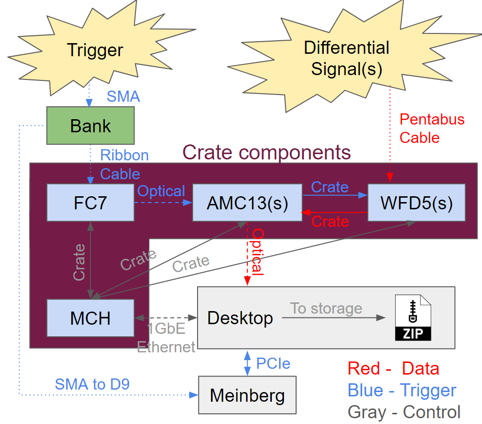

# Hardware Documentation

## General Hardware Overview
### Conceptual Diagram (One Crate System)
{: style="max-width:100%; height:auto;"}

- **Differential signal into WFD5 (Waveform Digitizer)**: Differential signaling are input into Cornell's WFD5s. Data is aggregated by AMC13 on triggers.
- **Trigger signal into FC7 (Flexible Controller)**: Provides flexible triggering, FC7 sends trigger signals over optical links to the AMC13.
- **AMC13 (Advanced Mezzanine Card)**: Aggregates data from digitizers on a trigger and packages for sending over 10GbE (10 Gigabit Ethernet). Transfers this to the desktop for further processing.
- **MCH (MicroTCA Carrier Hub)**: Facilitates communication between the desktop and the crate system via 1GbE Ethernet, managing system-level (crate) operations in a way.
- **Desktop CPU**: Processes events received from the AMC13. Data is unpacked and formed into midas events for storage.
- **Meinberg**: Provides precise trigger timestamps using GPS timing. This is an artifact of g-2 more than anything, were multiple disconnected systems needed to be correlated. 

### Labled Picture (One Crate System)
{: style="max-width:100%; height:auto;"}

---

## WFD5 (Waveform Digitizer)

### Configuration

### Updating Firmware

---

## FC7 (Flexible Controller)

### Configuration

### Updating Firmware

---

## AMC13 (Advanced Mezzanine Card)

### Configuration

### Updating Firmware

---

## MCH (MicroTCA Carrier Hub)

### Configuration
