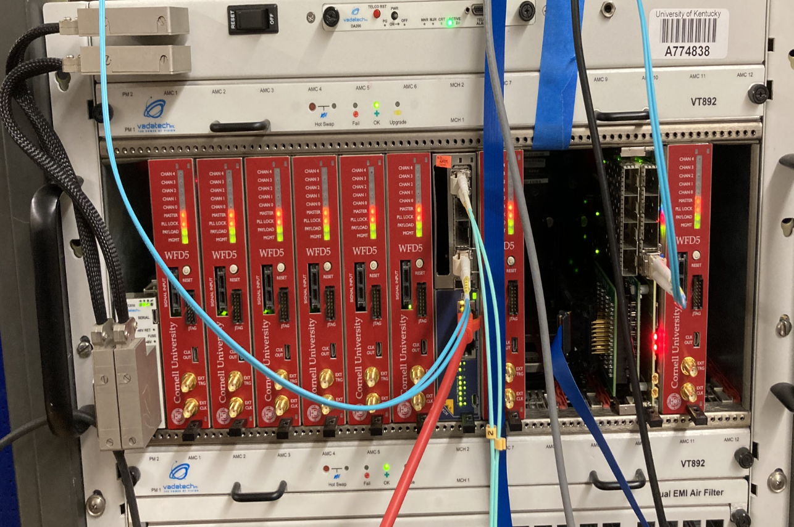

# Welcome to the g-2 Modifed DAQ Manual

{: style="max-width:100%; height:auto;"}

The purpose of this manual is to aid users with setup, usage, and debugging of the g-2 modified DAQ. This DAQ's purpose is to aid with various test stands across the PIONEER collaboration. Most topics are simplified to only include information needed for operating this DAQ. Some external links are provided for additional, generalized information.

## Contact
Created by Jack Carlton.  
Ph.D. Candidate, Department of Physics and Astronomy, University of Kentucky.

- Email: [j.carlton@uky.edu](mailto:j.carlton@uky.edu)
- GitHub: [jaca230](https://github.com/jaca230)
