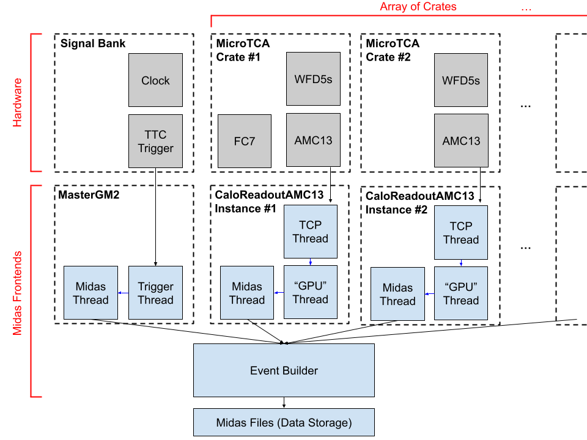

# Installing and Running g-2 modified DAQ
## Overview

The g-2 modified DAQ software repurposes the DAQ software used for g-2 to be slightly more flexible. It allows for readout and communication with hardware described in the [Hardware Overview](hardware_overview.md) page.

### Software Diagram

{: style="max-width:100%; height:auto;"}
**Note**: Not pictured are the hardware links, see [Hardware Diagram](hardware_overview.md#conceptual-diagram-one-crate-system)

#### MasterGM2
This is a C++ executable midas frontend whose job is to count triggers to check that crate hardware and CaloReadoutAMC13 frontends are not missing triggers.

- **Trigger Thread**: Recieves processed triggers from a source (ex. Meinberg PCIe Card) and reports them to the Midas thread.
- **Midas Thread**: Puts data recieved from trigger thread into a midas bank for each event

#### CaloReadoutAMC13
This is a C++ executable midas frontend whose job is to recieve digitized data from the AMC13 and process it before being placed in midas data banks.

- **TCP Thread**: Recieves TCP packets over 10GbE from an AMC13. Unpacks the data into header, trailer, and payload information.
- **"GPU" Thread**: Recieves processed data from TCP thread. In g-2, GPUs were used for additional data processing. They have been turned off and the "GPU" thread is a legacy buffer for the data to go through. No processing is done on the data here.
- **Midas Thread**: Puts data recieved from gpu thread into midas banks for each event

#### Event Builder
This is a C++ executable midas frontend whose job is to collect data sitting in the midas buffers of all the frontends (MasterGM2, CaloReadoutAMC13 #1, CaloReadoutAMC13 #2, ...) and combine them into one midas event before being logged to a data file.

---

## Installer
There is an [installer for the g-2 modified DAQ](miscellaneous_info.md#2023-psi-lyso-testbeam-daq-installer). Though, it is currently out of date and I would not recommend using it.

---

## Manual Installation Guide

1 **Install Software Dependencies**

[ROOT](software_dependencies.md#root), [Midas](software_dependencies.md#midas), [Boost](software_dependencies.md#boost), [ipmitool](software_dependencies.md#ipmitool), and [Cactus](software_dependencies.md#ipbus-cactus), and the [System Monitor](software_dependencies.md#system-monitor) are all required to build and run the DAQ frontends. [Meinberg](software_dependencies.md#meinberg) is needed if using GPS mode for the master triggers. Install them following the instructions on the [Software Dependencies Page](software_dependencies.md).

2 **Clone the Appropriate Branch**

Make sure you have access to the [PIONEER Experiment GitHub](https://github.com/PIONEER-Experiment). See these [contacts](software_dependencies.md#pioneer-experiment-repositories) for gaining access. Additionally, make sure your github account is linked to your system via SSH token; you can do this by following [these instructions](software_dependencies.md#setting-up-a-github-ssh-token-on-rhel79-systems). After installing the software dependencies, you should have a `packages` directory, where it's best to put the software. To clone, follow the commands below:

```
cd /path/to/packages
mkdir experiment
cd experiment
git clone --branch multi-crate https://github.com/PIONEER-Experiment/gm2daq-modified.git
cd gm2daq-modified
git checkout multi-crate
```

**Note**: To clone a different branch, simply change the `--branch` parameter from `multi-crate` to the appropriate branch. You can also checkout a different branch after this is done.

3 **Setup Environment**

```
cd environment_setup
./detect_environment.sh
```

This will populate a local file `environment_variables.txt`, check it with:
```
cat environment_variables.txt
```

Here's an example of what `environment_variables.txt` will look like
```
GM2DAQ_DIR=/home/installation_testing/packages/experiment/lxedaq
CACTUS_ROOT=/home/installation_testing/packages/cactus
BOOST_ROOT=/home/backup_installation_testing/packages/boost-1.53.0
PUGIXML_ROOT=/home/installation_testing/packages/pugixml-1.8
ROOT_ROOT=/usr/include/root
SYSTEM_MONITOR_ROOT=/home/installation_testing/packages/system_diagnostics
MIDASSYS=/home/installation_testing/packages/midas
MIDAS_EXPTAB=/home/installation_testing/online/exptab
MIDAS_EXPT_NAME=DAQ
```

Verify that each environment variable above points to the correct path for each piece of software. If not, manually change it with your favorite text editor. Then, run
```
source ./setup_environment.sh
```

**Note**: To set up the environment every time you log in automatically, source this script in your `.bashrc` file. Modify the path in the following command to add `setup_environment.sh` to the .bashrc file
```
echo "source /path/to/gm2daq-modified/environment_setup/setup_environment.sh" >> ~/.bashrc
```

4 **Make Frontends**

Make the master frontend:
```
cd $GM2DAQ_DIR/frontends/MasterGM2
make clean
make -j$(nproc)
```

Make the AMC13 readout frontend:
```
cd $GM2DAQ_DIR/frontends/CaloReadoutAMC13
make clean
make -j$(nproc)
```

Make the event builder frontend:
```
cd $GM2DAQ_DIR/eventbuilder
make clean
make
```


5 **Configure Crate Contents File**

Edit `AMC13xx_config.xml` file in your favorite text edit, for instance:
```
vi $GM2DAQ_DIR/frontends/AMC13xx_config.xml
```
An example file for a one crate system looks like this:
```
<!-- The purpose of this file is to specify what devices are in each frontend crate -->
<!-- To declare frontend AMC13xx create root node <frontend id="xx">  -->
<!-- (xx = "0" will automatically be written as "00" in ODB settings, i.e. single digits are okay) -->
<!-- To declare device in slot 'y' of create, create node <slot id="y" type="device_type" -->
<!-- Select "device_type" from FC7, WFD, or Rider (WFD and Rider are the same device) -->
<?xml version="1.0" encoding="UTF-8"?>
<frontend id="1">
    <slot id="1"  type="WFD" />
    <slot id="2"  type="WFD" />
    <slot id="3"  type="WFD" />
    <slot id="4"  type="WFD" />
    <slot id="5"  type="WFD" />
    <slot id="6"  type="WFD" />
    <slot id="7"  type="WFD" />
    <slot id="10" type="FC7" />
    <slot id="11"  type="WFD" />
</frontend>
```
An example file for a two crate system looks this like:
```
<?xml version="1.0" encoding="UTF-8"?>
<frontend id="1">
    <slot id="1"  type="WFD" />
    <slot id="2"  type="WFD" />
    <slot id="3"  type="WFD" />
    <slot id="4"  type="WFD" />
    <slot id="5"  type="WFD" />
    <slot id="6"  type="WFD" />
    <slot id="7"  type="WFD" />
    <slot id="10" type="FC7" />
    <slot id="11"  type="WFD" />
</frontend>
<frontend id="2">
    <slot id="3" type="WFD" />
    <slot id="5" type="WFD" />
</frontend>
```

**Note**: The frontend id should correspond to the subnet you placed (or will place) the crate components on when configuring the hardware.

This file is used to build the ODB. **Any hardware not specified in this file will be ignored.** You can still disable any hardware listed in this file in the ODB after it has been generated. However if you want to move the FC7 to a different slot, this file and the ODB need to be editted accordingly.

6 **Start Midas Webpage**
```
cd $GM2DAQ_DIR/webpage_scripts
./start_midas_webpage
```
Then open `localhost:8080` in your favorite web browser.

**Note**: If this doesn't work, verify that `mlogger`, `mhttpd` (or `mhttpd6`), and `mserver` and all running as screens, i.e. check:
```
screen -ls
```
You can also run `mhttpd` manually to look for error messages for debugging:
```
$MIDASSYS/bin/mhttpd
```


7 **Generate the ODB**

The first time the frontends are run, they will automatically populate the ODB with the default settings. Run the frontends for the first time (they will error out):

```
cd $GM2DAQ_DIR/frontends/MasterGM2
./frontend -e DAQ
```

```
cd $GM2DAQ_DIR/frontends/CaloReadoutAMC13
./frontend -e DAQ -i {frontend id}
```
where `{frontend id}` is replaced with the frontend ids specified in the crate configuration file above. This command needs to be run once for each frontend (each crate) to properly generate the ODB.

On the midas webpage view the ODB. Verify that `/Equipment/MasterGM2` and each `/Equipment/AMC13xxx` now exist.

8 **Configure the ODB**

Before the DAQ can run, the ODB needs to be properly configured. First, make sure the Logger [writes data](odb_config.md#toggle-logger-data-writing) and [makes ODB backup files for each run](odb_config.md#toggle-logger-to-generate-odb-backups-for-each-run). Then following the instructions on the [ODB configuration page](odb_config.md#g-2-modified-daq-specific-odb-configuration), read through each setting and ensure they are correct for your setup.

---

## Running the Frontends


### Starting Frontends "by Hand"
The first time you run the frontends, I suggest dedicating one terminal window to each so you can inspect for errors. Each frontend will occupy a terminal window.

#### Master Frontend

**The Master frontend must be started first** because it does some general AMC13 and FC7 initilization. Run
```
cd $GM2DAQ_DIR/frontends/MasterGM2
./frontend -e DAQ
```
The `-e` flag specifies the experiment name. This is found in the file located at `$MIDAS_EXPTAB`.

Wait until this frontend prints `OK` (or until it turns and stays green on the midas status webpage).


#### AMC13 Readout Frontends

This frontend(s) must be started **after the Master frontend has initialized**. You can start multiple instances at the same time, but in my experience this causes midas to complain about ODB space (you may be able to get around this by [increasing the ODB size](midas.md#changing-the-odb-size), I've never tried).

```
cd $GM2DAQ_DIR/frontends/CaloReadoutAMC13
./frontend -e DAQ -i {frontend id}
```

The `-e` flag specifies the experiment name. This is found in the file located at `$MIDAS_EXPTAB`. <br>
The `-i` flag specifies frontend index. `{frontend id}` is replaced with the frontend ids specified in the crate configuration file above. <br>
This command needs to be run once for each AMC13 frontend (each crate). 

Wait until this frontend prints `OK` (or until it turns and stays green on the midas status webpage).


#### Event Builder Frontend

Once all of the other frontends have finished initializing, you can start the event builder.

```
./mevb -e DAQ -b BUF
```

The `-e` flag specifies the experiment name. This is found in the file located at `$MIDAS_EXPTAB`. <br>
The `-b` flag specifies the buffer it will look for to create events. Any frontend writing to a buffer starting with `BUF` will added to an event by the event builder. You can check each frontend's buffer in it's `Common` page in the ODB, see [changing buffer for a frontend](odb_config.md#change-the-data-buffer-for-a-frontend).

Wait until this frontend turns green on the status page.

### Screening the Frontends

Screening the frontends is slightly convoluted because you have to stuff all the appropriate environment variables into the screen session. If you are unfamiliar with screens, you may want [view some learning material for using screens](miscellaneous_info.md#using-screens-in-linux). You made need to make [an edit to your .screenrc](miscellaneous_info.md#getting-ld_library_path-into-a-screen-session) for this to work properly. Other than this, there are scripts provided to launch the frontends in a screen.

#### Master Frontend

**The Master frontend must be started first** because it does some general AMC13 and FC7 initilization. Run
```
$GM2DAQ_DIR/frontends/MasterGM2/start-fe-uky.sh DAQ master
```
The first argument is the experiment name which should be the value of `$MIDAS_EXPT_NAME`. <br>
The second argument is the name for the screen session.

Wait until this frontend prints `OK` (or until it turns and stays green on the midas status webpage).


#### AMC13 Readout Frontends

This frontend(s) must be started **after the Master frontend has initialized**. You can start multiple instances at the same time, but in my experience this causes midas to complain about ODB space (you may be able to get around this by [increasing the ODB size](midas.md#changing-the-odb-size), I've never tried).

```
$GM2DAQ_DIR/frontends/CaloReadoutAMC13/start-fe-uw.sh 1 DAQ amc13001
```

The 1st argument is the frontend index, it should match the `-i` argument when starting this [frontend by hand](installing_and_building.md#amc13-readout-frontends). <br>
The 2nd argument is the experiment name. This is found in the file located at `$MIDAS_EXPTAB`. <br>
The 3rd is the name for the screen session.

This command needs to be run once for each AMC13 frontend (each crate). 

Wait until this frontend prints `OK` (or until it turns and stays green on the midas status webpage).


#### Event Builder Frontend

Once all of the other frontends have finished initializing, you can start the event builder. There is no script for this screen, just a simple screen command. The flags are the same as when [starting this frontend by hand](installing_and_building.md#event-builder-frontend).

```
screen -dmS event_builder $GM2DAQ_DIR/eventbuilder/mevb -e DAQ -b BUF
```

### Startup Scripts on Midas Programs Page

See the [adding program startup scripts](midas.md#adding-program-startup-scripts) page to see how to add startup programs. Make `Programs/{Frontend Name}/Required` is set to `yes`. Then copy the screen command for each respective frontend into `Programs/{Frontend Name}/Start Command`.
 
---