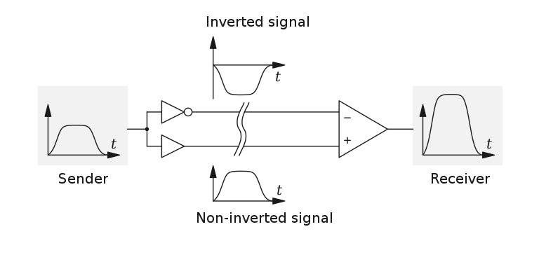
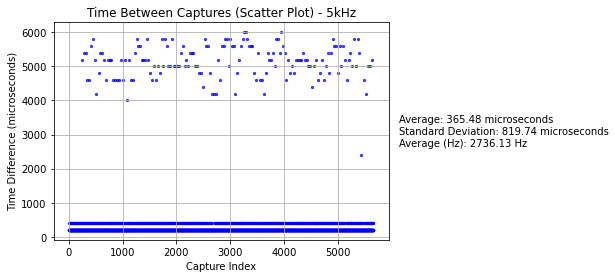
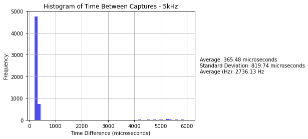
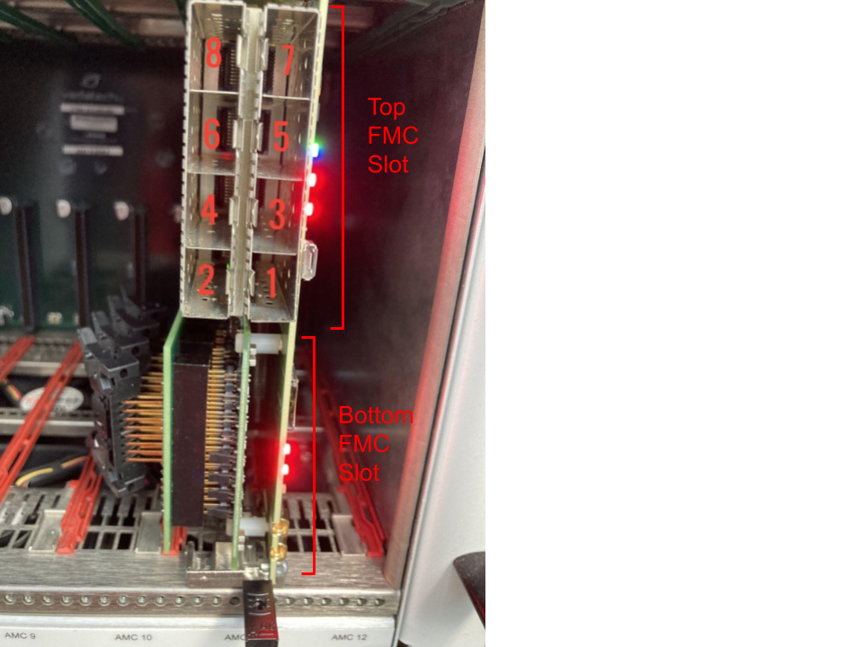
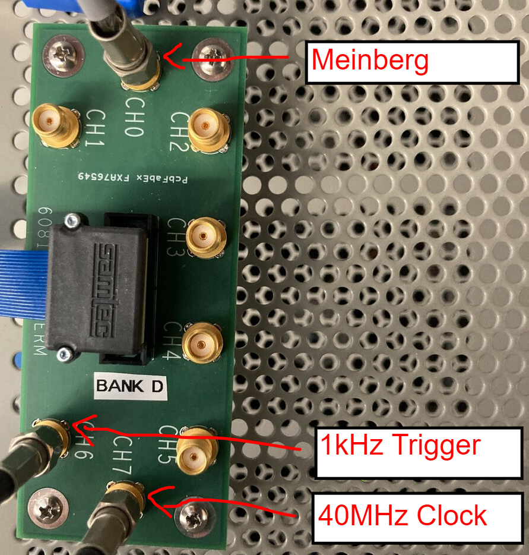

# Miscellaneous Information

## Additional Notes

If you're feeling desperate (or perhaps lucky), you can sift through [Jack Carlton's work notes](https://jaca230.github.io/joplin_notes_page/). **I warn you that these are not well organized and contain lots of information not about this DAQ**. However, they do contain some documentation of my assembly and troubleshooting of this DAQ.

## What is (was) g-2?
[g-2](https://muon-g-2.fnal.gov/#:~:text=The%20Muon%20g%2D2%20experimenters,of%200.14%20parts%20per%20million.) was an experiment to that examined the precession of muons that are subjected to a magnetic field to test the standard model's prediction of muon g factor. Because many of the g-2 collaborators now work on PIONEER, it is convienent to repurpose the data acquisition system used for g-2 for PIONEER test stands.

## Initialism Cheatsheet
| Initialism | Meaning                               | Example                      |
|------------|---------------------------------------|------------------------------|
| DAQ        | Data Acquisition                      |                              |
| ADC        | Analog-to-Digital Converter           |                              |
| 10GbE      | 10 Gigabit Ethernet                   |                              |
| AFE        | Analog Front End                      |                              |
| FPGA       | Field Programmable Gate Array         |                              |
| FMC        | FPGA Mezzanine Card                   | FC7 SFP Interface            |
| CPU        | Central Processing Unit               | Intel Core i7-12700K         |
| GPU        | Graphics Processing Unit              | NVIDIA A5000                 |
| uTCA (µTCA)| Micro Telecommunications Computing Architecture |                    |
| WFD        | Waveform Digitizer                    | WFD5                         |
| FC         | Flexible Controller                   | FC7                          |
| AMC        | Advanced Mezzanine Card               | AMC13 (also FC7 and WFD5)    |
| MCH        | MicroTCA Carrier Hub                  |                              |
| DDR        | Double Data Rate                      | DDR3, DDR4 (RAM)             |
| PCIe       | Peripheral Component Interconnect Express | PCIe2, PCIe3, ...        |
| SFP        | Small Form-factor Pluggable           | Finisar  SFP transceiver     |
| SFP+       | Enhanced Small Form-factor Pluggable  | Avago SFP+ transceiver       |
| CLI        | Command Line Interface                |                              |
| TTC        | Timing, Trigger, and Control          |                              |
| MTU	     | Maximum Transmission Unit             |                              |	
| IP	     | Internet Protocol                     |                              |

---

## Differential Signals

{: style="max-width:100%; height:auto;"}

Differential signals offer several advantages over single-ended signals:

- **More resistant to noise**: Differential signaling reduces susceptibility to noise interference, resulting in cleaner signal transmission.
- **Lower supply voltages**: Differential signaling allows for the use of lower supply voltages (like Low Voltage CMOS (LVCMOS) at 3.0–3.3V), which can lead to reduced power consumption.
- **Higher operating frequencies**: Due to better noise immunity and lower voltage swings, differential signals enable higher operating frequencies in electronic circuits.

[Read more about differential signaling on Wikipedia](https://en.wikipedia.org/wiki/Differential_signalling).

---

## Limitations of Meinberg Card
The meinberg card seems to be limited to rates of ~2.5KHz. While this is not a critical (run ending) issue, the meinberg will have to "catch up" at the end of runs. It may also need to be removed from the event buider (i.e. [change the buffer it writes on](odb_config.md#change-the-data-buffer-for-a-frontend) to something that doesn't include "BUF" at the beginning).

[In a study performed on the meinberg card](pdfs/Meinberg_Timing.pdf), we found it behaves strangley at high rates. Sometimes it "misses" events and sometimes is has long wait periods. See the plots below.

{: style="max-width:100%; height:auto;"}

{: style="max-width:100%; height:auto;"}

---

## Port Forwarding an SSH Connection

In many cases, you will need to access a web server running on a remote machine that has no Graphical User Interface (GUI). This can be done securely using SSH port forwarding. Below are instructions for setting up port forwarding on a RHEL Linux machine so you can view a webpage served on `localhost:8080` from your local machine with a GUI (ex. laptop).

### Prerequisites

- SSH access to the remote RHEL Linux machine.
- An SSH client on your local machine. e.g. `ssh` command in a terminal, (you can also use PuTTY on Windows though I would not recommend this; you can still use ssh on windows).
- Ensure the remote machine is configured to allow SSH connections. The SSH service should be running, and the firewall should permit SSH traffic (usually on port 22).

### Instructions

1 **Ensure SSH service is running on the remote machine:**

```
sudo systemctl start sshd
sudo systemctl enable sshd
```

2 **Configure the firewall to allow SSH connections on the remote machine:**

```
    sudo firewall-cmd --permanent --add-service=ssh
    sudo firewall-cmd --reload
```

3 **Open a terminal on your local machine.**

4 **Establish an SSH connection with port forwarding:**

Use the following command to create an SSH tunnel. Replace `user` with your username on the remote machine and `remote_host` with the IP address or hostname of the remote machine.

```
ssh -L 8080:localhost:8080 user@remote_host
```

This command forwards your laptop's port `8080` to the remote machine's port `8080`. Here's a breakdown of the command:

- `-L 8080:localhost:8080`: Specifies the local port (`8080`) to be forwarded to the remote port (`8080` on `localhost` of the remote machine).
- `user@remote_host`: The SSH login to the remote machine.

5 **Access the webpage:**

Open a web browser on your laptop and navigate to:

```
http://localhost:8080
```

You should see the webpage served by the remote machine on port `8080`.

### Example

If you want to access the root user on a machine with IP 192.168.50.10:

```
ssh -L 8080:localhost:8080 root@192.168.50.10
```

After running this command, open a browser on your laptop and go to `http://localhost:8080` to view the webpage hosted on the remote machine.

### Notes

- Ensure that the web server on the remote machine is configured to listen on `localhost:8080` and is running.
- If port `8080` is already in use on your local machine, you can use a different local port (e.g., `9090`) by changing the command to `-L 9090:localhost:8080` and then accessing `http://localhost:9090` on your laptop.

This setup allows you to securely access the web server running on your remote RHEL machine from your local laptop using SSH port forwarding.

---

## 2023 PSI LYSO Testbeam DAQ Installer
There is a [gm2daq-installer](https://github.com/PIONEER-Experiment/gm2daq-installer) that has been tested on RHEL7 systems. This will attempt to install the listed packages below. This installer's purpose was to streamline installation of the 2023 PSI LYSO testbeam usage of the DAQ. **WARNING: As some of these packages have been updated, the installer may fail. Use this at your own disgression.** In particular, I don't expect the [unpacker](), [publisher](), [meinberg](software_dependencies.md#meinberg), and [gm2daq software](installing_and_building.md#manual-installation-guide) to install correctly. If you use this tool, it would be best to install those by hand if needed by following the links. Furthermore on RHEL9 systems (such as ALMA9) , the distributed pre-compiled binaries are more up to date, which simplifies the installation process greatly. As a result, I would only suggest using the installer for RHEL7 systems (such as SL7 or CentOS7).


To attempt to install everything with the installer:
```
git clone git@github.com:PIONEER-Experiment/gm2daq-installer.git
cd gm2daq-installer
./install.sh
```

### List of Installed Software
If you navigate to
```
cd gm2daq-installer/subprocess_scripts
```
you can install packages individually:

| Script Name                   | Description                                 |
|-------------------------------|---------------------------------------------|
| `install_epel-release.sh`     | Installs EPEL Release                       |
| `install_openssl-devel.sh`    | Installs OpenSSL Development Libraries      |
| `install_cmake.sh`            | Installs CMake                              |
| `install_cmake3.sh`           | Installs CMake3                             |
| `install_readline.sh`         | Installs Readline Development Tools         |
| `install_root.sh`             | Installs ROOT (pre-compiled binary)         |
| `install_erlang.sh`           | Installs Erlang                             |
| `install_zlib.sh`             | Installs zlib Development Libraries         |
| `install_devtoolset-8.sh`     | Installs Devtoolset-8                       |
| `install_devtoolset-11.sh`    | Installs Devtoolset-11                      |
| `install_rh-python36.sh`      | Installs Python 3.6                         |
| `install_libXft.sh`           | Installs libXft Development Libraries       |
| `install_libXpm.sh`           | Installs libXpm Development Libraries       |
| `install_libXt.sh`            | Installs libXt Development Libraries        |
| `install_libXext.sh`          | Installs libXext Development Libraries      |
| `install_patch.sh`            | Installs Patch Development Tools            |
| `install_libtool.sh`          | Installs Libtool Development Tools          |
| `install_meinberg_driver.sh`  | Installs Meinberg Driver                    |
| `install_midas.sh`            | Installs MIDAS                              |
| `install_pugixml.sh`          | Installs pugixml Development Libraries      |
| `install_boost_1_53_0.sh`     | Installs Boost 1.53.0                       |
| `install_cactus.sh`           | Installs Cactus                             |
| `install_gm2daq.sh`           | Installs gm2daq                             |
| `install_root_from_source.sh` | Installs ROOT (from source)                 |
| `install_boost_1_70_0.sh`     | Installs Boost 1.70.0                       |
| `install_zeroMQ.sh`           | Installs ZeroMQ Development Libraries       |
| `install_cppzmq.sh`           | Installs C++ ZeroMQ                         |
| `install_eigen.sh`            | Installs Eigen Development Libraries        |
| `install_unpacker.sh`         | Installs Midas Data File Unpacker           |
| `install_publisher.sh`        | Installs Midas Data Publisher               |


you can also run
```
./install.sh --skip root_from_source,zeroMQ,...
```
to skip certain packages, for example. From the list above, remove the `install_` and `.sh` parts and add it to the comma seperated list following the `--skip` flag to skip it. For instance, I would recommend trying:

---

## FC7 Labeling

{: style="max-width:100%; height:auto;"}

These labelings are particularly useful when configuring the [CCC ODB settings](odb_config.md#ccc-fc7-slot-number-1-12)

---

## Using Screens in Linux

Screens are useful for running the DAQ because it allows you start and view multiple frontends on one terminal. You can read more on [this webpage](https://www.geeksforgeeks.org/screen-command-in-linux-with-examples/) for example. Below are a few useful screen commands:

### Starting a Screen

```
screen -S <session_name>
```

### Listing Screens

```
screen -ls
```

### Stopping a Screen

To stop a screen session, first list all sessions to find the session ID:
```
screen -ls
```

Then, stop the desired screen session:
```
screen -X -S <session_id> quit
```

### Attaching to a Screen

```
screen -r <session_name>
```

### Detaching from a Screen
To detach from a screen session you have attached to, press `Ctrl + a` and `d`. This will return you to your previous shell session.

### Scrolling up in a Screen
To scroll up in a screen session, press `Ctrl + a` and then `[`. Use the arrow keys to navigate. To exit scroll mode, press `q`.

---

## Getting `LD_LIBRARY_PATH` Into a Screen Session
For some reason, stuffing `LD_LIBRARY_PATH` into a screen session is convoluted. To copy your current shell sessions `LD_LIBRARY_PATH` environment variable into a screen session, you need to edit your `.screenrc` file for the profile you launch the screen from. Simply run these two commands:

```
touch ~/.screenrc
echo 'shell -/bin/bash -c "export LD_LIBRARY_PATH=$LD_LIBRARY_PATH && exec /bin/bash"' >> ~/.screenrc
```

Now for every new screen session, your `LD_LIBRARY_PATH` environment variable will be copied over from your current shell session to the new screen session. This is useful when you have custom libraries added to your `LD_LIBRARY_PATH`; the environment setup script used in the [DAQ installation guide](installing_and_building.md#manual-installation-guide) adds some custom libraries `LD_LIBRARY_PATH`.

---

## The N.A.T. MCH

### Overview

An alternative to the [VadaTech MCH](hardware_overview.md#mch-microtca-carrier-hub), it has the same functionality.

### Configuration

See [NAT MCH manual](https://nateurope.com/wp-content/uploads/2022/09/NAT-MCH_UsersManual.pdf) for more details. Depending on the NAT MCH version, you may be able to ssh into the NAT MCH.


In any event, you can configure the NAT MCH with `telnet`
```
sudo yum install telnet
telnet 192.68.1.41
```

From there you can follow the prompts to configure the NAT MCH. If you are having trouble finding the NAT MCH IP try pinging or [scanning the network](networking.md#scanning-a-network).

---

## Finisar SFP vs. Avago SFP+

SFP+s (such as Avago SFP+s) do not work with the FC7 to AMC13 link; an SFP (such as a finisar SFP) is needed. Similarly, the 10GbE links from AMC13 to the DAQ computer must use SFP+s.

---

## Bank Signals

{: style="max-width:100%; height:auto;"}

Copies of D0-D3 triggers are sent out of D0-D3, while D4-D7 should be configured to be input signals. The trigger input should go to D6 (It does not have to be 1kHz). A 40MHz clock should go in D7.

---
